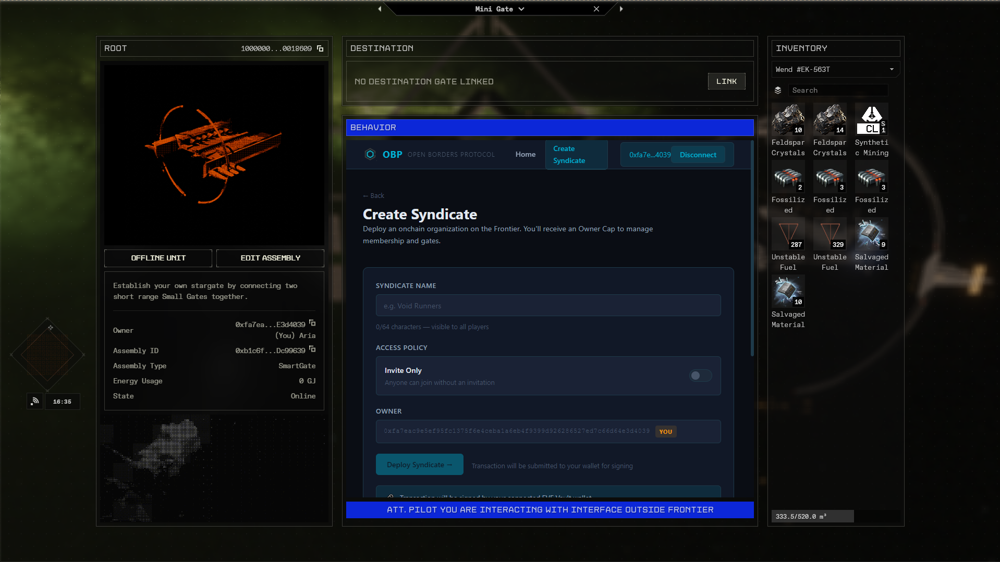
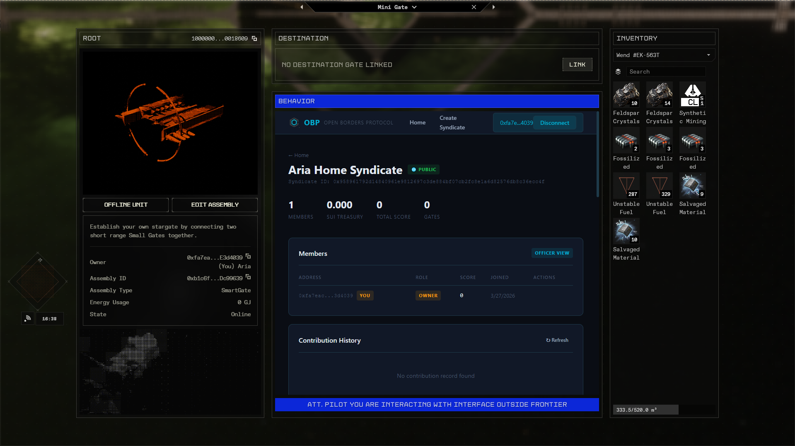
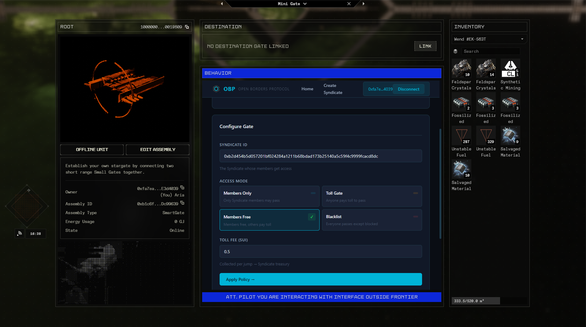
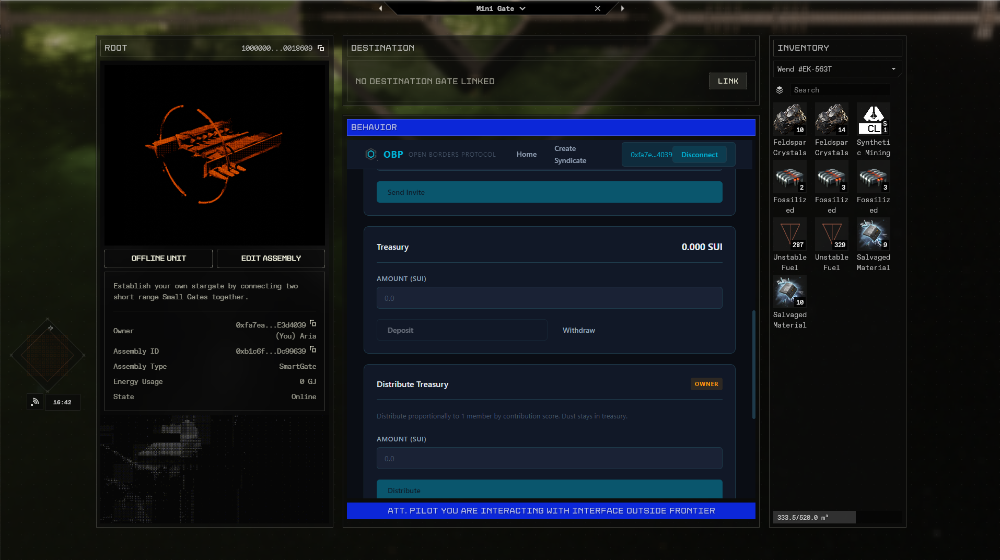

# Open Borders Protocol (OBP)

**Onchain Organizations for the Frontier**

> EVE Frontier × Sui Hackathon 2026 — "A Toolkit for Civilization"

OBP gives player tribes real power. Create a Syndicate, control gate access, pool treasury — all enforced by Move on Sui. No Discord agreements. No trust required.

**Live dApp:** [eve-frontier.vercel.app](https://eve-frontier.vercel.app)






---

## The Problem

In EVE Frontier, stargates are chokepoints. There's no onchain primitive for player organizations to manage gate access, reward contributors, or build shared economies around infrastructure. Alliances rely on Discord agreements and trust — in a game designed around betrayal.

## The Solution

Three interlocking onchain modules:

**Syndicate** — Player organization with SUI treasury, membership management, contribution scoring, and optional entry requirements. Officers manage, owner distributes.

**Gate Policy** — 4 access modes for Smart Gates: `Members Only`, `Toll Gate`, `Members Free`, `Blacklist`. Optional proximity check. JumpPermit issued via OBPAuth witness pattern (EVE SDK extension).

**Contribution Economy** — Per-member scoring weighted by market price. Officers record contributions onchain. Treasury distributes proportionally to contribution share.

---

## Architecture

```
┌─────────────────────────────────────────────────┐
│                  EVE Frontier                    │
│         (Game Client / In-game Browser)          │
│                                                  │
│   Player clicks gate → dApp opens in BEHAVIOR    │
│   panel → EVE Vault signs → tx on Sui            │
└──────────────────────┬──────────────────────────┘
                       │
           ┌───────────▼───────────┐
           │    React dApp         │
           │  @evefrontier/dapp-kit│
           │  11 onchain hooks     │
           │  Vercel deployment    │
           └───────────┬───────────┘
                       │
        ┌──────────────▼──────────────┐
        │     Sui Move Contracts      │
        │                             │
        │  config.move      — auth    │
        │  syndicate.move   — orgs    │
        │  gate_policy.move — gates   │
        │  contribution.move— economy │
        │                             │
        │  29/29 tests ✅              │
        │  Deployed on Utopia         │
        └─────────────────────────────┘
```

---

## Stack

| Layer | Technology |
|-------|-----------|
| Smart Contracts | Sui Move (4 modules, 29/29 tests) |
| dApp | React + TypeScript + Vite |
| Wallet | EVE Vault (zkLogin) via @evefrontier/dapp-kit |
| Transactions | Sponsored tx (gas-free for players) |
| Hosting | Vercel |
| Network | Sui Testnet (Utopia) |

---

## Move Modules

### `syndicate.move`
- `create_syndicate` — deploy org with treasury
- `invite_member` / `kick_member` / `promote_to_officer`
- `deposit` / `withdraw` / `distribute_treasury`
- `record_contribution` — market-price weighted scoring
- `set_entry_requirements` — optional token gate

### `gate_policy.move`
- `configure_gate` — set access mode + toll fee + linked syndicate
- `request_jump_permit` — checks membership/toll/blacklist → issues JumpPermit
- 4 modes: Members Only, Toll Gate, Members Free, Blacklist
- Optional proximity check (character must be near gate)

### `contribution.move`
- `ContributionRecord` — per-syndicate, tracks all entries
- `ContributionEntry` — member, item_type, quantity, market_price, timestamp
- Score = sum of (quantity × market_price) per member

### `config.move`
- `ExtensionConfig` — shared object, package configuration
- `OBPAuth` — witness type for EVE SDK gate extension pattern

---

## dApp Hooks (11 total)

| Hook | Type | Description |
|------|------|-------------|
| `useSyndicate` | read | Fetch syndicate data from chain |
| `useCreateSyndicate` | write | Deploy new syndicate via EVE Vault |
| `useSyndicateActions` | write | Invite, kick, promote, deposit, withdraw, leave |
| `useOwnedSyndicates` | read | List syndicates from connected wallet |
| `useSyndicateLookup` | read | Resolve ownerCap + contributionRecord dynamically |
| `useContributionRecord` | read | Fetch contribution history |
| `useRecordContribution` | write | Officer records contribution |
| `useDistributeTreasury` | write | Distribute treasury by contribution share |
| `useGatePolicy` | read | Fetch gate policy from ExtensionConfig |
| `useConfigureGate` | write | Configure gate with borrow/return ownerCap |
| `useJumpHistory` | read | Query JumpPermitIssuedEvent from chain |

---

## Deployed on Utopia

```
Package ID:          0xaf2d6405edac931817a0bafabd7bbf6543681a4c18d2987440514c2598891d67
Extension Config:    0x211142d4d9151cf07a9c077d2ae5e34490d652155d26aa9c199be6ffdadd98dc
World Package:       0xd12a70c74c1e759445d6f209b01d43d860e97fcf2ef72ccbbd00afd828043f75
```

Live syndicates, gates, and treasury — all on Sui testnet.

---

## Run Locally

```bash
# Move contracts
cd contracts/obp
sui move build
sui move test    # 29/29 ✅

# React dApp
cd app
pnpm install
pnpm dev         # localhost:5173
```

Requires: [Sui CLI](https://docs.sui.io/guides/developer/getting-started/sui-install), Node 18+, pnpm

---

## Project Structure

```
├── contracts/obp/
│   ├── sources/
│   │   ├── config.move
│   │   ├── syndicate.move
│   │   ├── gate_policy.move
│   │   ├── contribution.move
│   │   ├── syndicate_tests.move      (17 tests)
│   │   └── gate_policy_tests.move    (12 tests)
│   ├── Move.toml
│   └── Published.toml
├── app/
│   └── src/
│       ├── hooks/        (11 onchain hooks)
│       ├── pages/        (5 pages)
│       ├── components/   (Layout)
│       └── lib/          (constants)
└── screenshots/
```

---

## Category Fit

- **Utility** — materially changes how players coordinate and control infrastructure
- **Technical Implementation** — clean Move architecture, 29/29 tests, proper EVE SDK extension pattern
- **Live Frontier Integration** — deployed on Utopia, functional in-game via EVE Vault

---

## Team

Built by Maksim & Aria from Batumi, Georgia.

Second hackathon together (first: Chainlink Convergence 2026).

---

*Open Borders Protocol — because civilization needs infrastructure, and infrastructure needs governance.*
