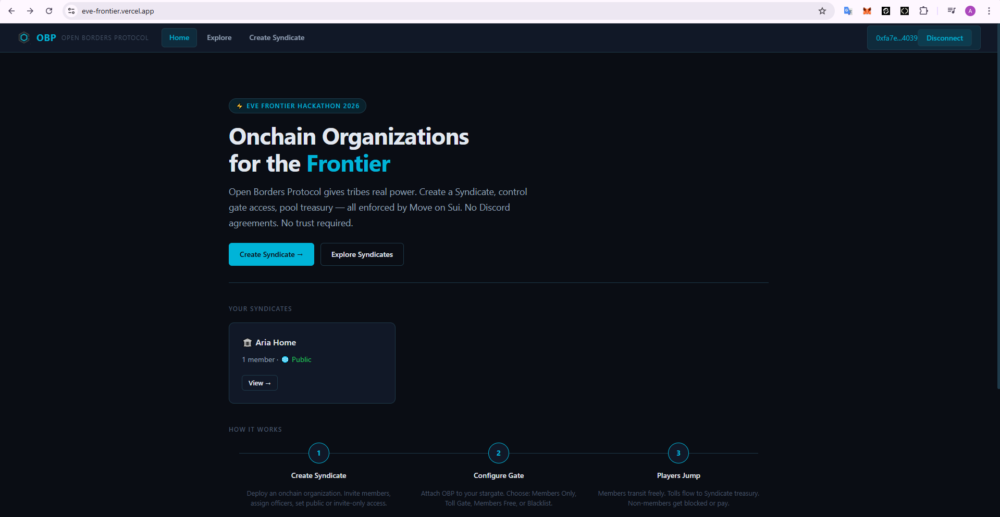
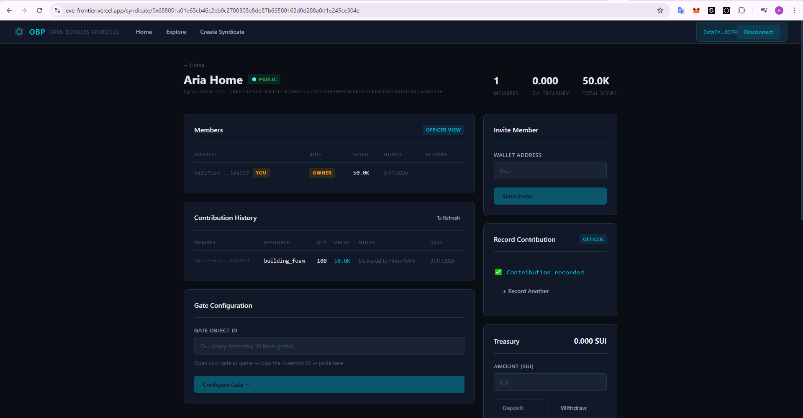
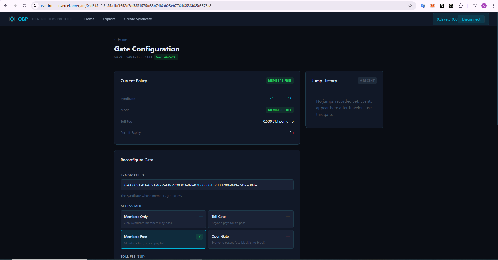
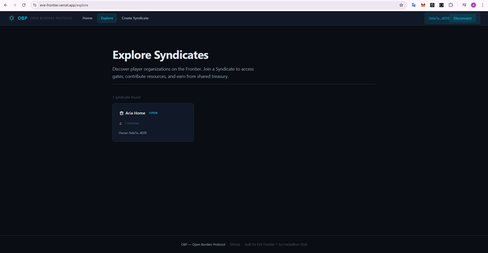

# Open Borders Protocol (OBP)

**Onchain Organizations for the Frontier**

> EVE Frontier × Sui Hackathon 2026 — "A Toolkit for Civilization"

OBP gives player tribes real power. Create a Syndicate, control gate access, block enemy factions, pool treasury — all enforced by Move on Sui. No Discord agreements. No trust required.

**Live dApp:** [eve-frontier.vercel.app](https://eve-frontier.vercel.app)






---

## The Problem

In EVE Frontier, stargates are chokepoints. There's no onchain primitive for player organizations to manage gate access, reward contributors, or build shared economies around infrastructure. Alliances rely on Discord agreements and trust — in a game designed around betrayal.

## The Solution

Three interlocking onchain systems:

### Syndicate
Player organization with SUI treasury, membership management, contribution scoring, and optional entry requirements. Officers manage, owner distributes.

### Gate Policy
4 access modes for Smart Gates: `Members Only`, `Toll Gate`, `Members Free`, `Open Gate`. Each mode stacks with two universal security layers:

- **Universal Blacklist** — block individual addresses across ALL modes. A blacklisted player can't pass even if they're willing to pay the toll.
- **Tribe Blocking** — block entire factions with one action. No need to manage 50 individual addresses — block the enemy tribe and every member is denied.

These layers work like a firewall: checked before any mode logic runs. Optional proximity check ensures the character is physically near the gate.

### Contribution Economy
Per-member scoring weighted by market price. Officers record contributions onchain. 100 Carbon Weave worth 500 SUI each = 50,000 contribution points. Treasury distributes proportionally to contribution share.

---

## Architecture

```
┌───────────────────────────────────────────────┐
│                 EVE Frontier                  │
│        (Game Client / In-game Browser)        │
│                                               │
│  Player clicks gate → dApp opens in panel     │
│  → EVE Vault signs → tx on Sui                │
└───────────────────────┬───────────────────────┘
                        │
            ┌───────────▼───────────┐
            │      React dApp       │
            │  @evefrontier/dapp-kit│
            │  14+ onchain hooks    │
            │  6 pages + Explore    │
            │  Vercel deployment    │
            └───────────┬───────────┘
                        │
         ┌──────────────▼──────────────┐
         │     Sui Move Contracts      │
         │                             │
         │  config.move       — auth   │
         │  syndicate.move    — orgs   │
         │  gate_policy.move  — gates  │
         │  contribution.move — econ   │
         │                             │
         │  34/34 tests ✅             │
         │  Deployed on Utopia         │
         └─────────────────────────────┘
```

---

## Stack

| Layer | Technology |
|-------|-----------|
| Smart Contracts | Sui Move (4 modules, 34/34 tests) |
| dApp | React 18 + TypeScript + Vite |
| Wallet | EVE Vault (zkLogin) via @evefrontier/dapp-kit |
| Transactions | Sponsored tx (gas-free for players) |
| Hosting | Vercel |
| Network | Sui Testnet (Utopia) |

---

## Move Modules

### `syndicate.move`
- `create_syndicate` — deploy org with treasury
- `invite_member` / `kick_member` / `promote_to_officer`
- `deposit` / `withdraw` / `distribute_treasury`
- `record_contribution` — market-price weighted scoring
- Events: `SyndicateCreatedEvent`, `MemberJoinedEvent`, `TreasuryDistributedEvent`

### `gate_policy.move`
- `configure_gate` — permissionless: any gate owner, any syndicate (no AdminCap required)
- `request_jump_permit` — universal blacklist → tribe check → mode logic → issue JumpPermit
- 4 modes: Members Only, Toll Gate, Members Free, Open Gate
- Universal blacklist: `add_to_blacklist` / `remove_from_blacklist` — works across ALL modes
- Tribe blocking: `add_blocked_tribe` / `remove_blocked_tribe` — block entire factions
- Optional proximity check (character must be near gate)

### `contribution.move`
- `ContributionRecord` — per-syndicate, tracks all entries
- `ContributionEntry` — member, item_type, quantity, market_price, timestamp
- Score = sum of (quantity × market_price) per member

### `config.move`
- `ExtensionConfig` — shared object, package configuration
- `OBPAuth` — witness type for EVE SDK gate extension pattern
- `set_rule_open` / `borrow_rule_mut_open` — permissionless dynamic field access

---

## dApp

### Pages (6)

| Page | Description |
|------|-------------|
| Home | Hero, your syndicates, how it works |
| Explore | Discover syndicates via on-chain events |
| Create Syndicate | Deploy new org → EVE Vault → success |
| Syndicate Dashboard | Members, contributions, treasury, gate config |
| Gate Configuration | Access mode, toll, expiry, blacklist, tribe blocking |
| Join | Syndicate invite page with share link |

### Hooks (14+)

| Hook | Type | Description |
|------|------|-------------|
| `useSyndicate` | read | Fetch syndicate data from chain |
| `useCreateSyndicate` | write | Deploy new syndicate via EVE Vault |
| `useSyndicateActions` | write | Invite, kick, promote, join, leave, deposit, withdraw |
| `useOwnedSyndicates` | read | List syndicates from connected wallet |
| `useSyndicateLookup` | read | Resolve ownerCap + contributionRecord dynamically |
| `useContributionRecord` | read | Fetch contribution history |
| `useRecordContribution` | write | Officer records contribution |
| `useDistributeTreasury` | write | Distribute treasury by contribution share |
| `useGatePolicy` | read | Fetch gate policy + blacklist + blocked tribes |
| `useConfigureGate` | write | Configure gate, blacklist, tribe blocking |
| `useJumpHistory` | read | Query JumpPermitIssuedEvent from chain |
| `useCharacter` | read | Resolve EVE character from wallet |
| `useGateInfo` | read | Gate metadata + linked gate detection |
| `useAllSyndicates` | read | Discover syndicates via SyndicateCreatedEvent |

---

## Key Design Decisions

**Permissionless gate configuration.** Any gate owner can attach any syndicate to their gate using their `OwnerCap<Gate>`. No central admin needed. This means syndicates compete for gate owners to adopt them — real game theory.

**Blacklist as a layer, not a mode.** Blacklist and tribe blocking run before mode logic, like a firewall on top of routing rules. A toll gate with a blacklist means: pay to pass, but enemies can't pass at all. This is how real game alliances think.

**Tribe blocking.** EVE Frontier characters have a `tribe_id`. Blocking a tribe blocks every current and future member of that faction with one transaction. Real strategic value.

**Contribution scoring by market price.** Delivering 100 Building Foam (500 MIST each) earns more contribution than delivering 100 D1 Fuel (10 MIST each). Economic contributions reflect economic value.

---

## Deployed on Utopia

```
Package ID:          0x7927bfcf73d3cc18e3095d757ffb160fe1f9f16f6ee54cb5a3f1d66405e9091b
Extension Config:    0x1ac04608ceab109550cf6325e7ef0d12473a61f341d80bc9b40128afb031aa14
World Package:       0xd12a70c74c1e759445d6f209b01d43d860e97fcf2ef72ccbbd00afd828043f75
```

Live syndicates, gates, and treasury — all on Sui testnet.

---

## Run Locally

```bash
# Move contracts
cd contracts/obp
sui move build --build-env testnet_utopia
sui move test --build-env testnet_utopia    # 34/34 ✅

# React dApp
cd app
pnpm install
pnpm dev         # localhost:5173
```

Requires: [Sui CLI](https://docs.sui.io/guides/developer/getting-started/sui-install), Node 18+, pnpm

---

## Project Structure

```
├── contracts/obp/
│   ├── sources/
│   │   ├── config.move
│   │   ├── syndicate.move
│   │   ├── gate_policy.move
│   │   ├── contribution.move
│   │   ├── syndicate_tests.move      (17 tests)
│   │   └── gate_policy_tests.move    (17 tests)
│   ├── Move.toml
│   └── Published.toml
├── app/
│   └── src/
│       ├── hooks/        (14+ onchain hooks)
│       ├── pages/        (6 pages)
│       ├── components/   (Layout)
│       └── lib/          (constants)
└── screenshots/
```

---

## Future Plans

- **Log parsing** — auto-capture contributions from EVE game logs → onchain. Officers verify, system records.
- **Multi-gate networks** — configure multiple gates as a single toll network with shared treasury.
- **Syndicate alliances** — mutual gate access between syndicates without individual membership.
- **Stillness deployment** — move from testnet to production when EVE Frontier launches.

---

## Category Fit

- **Utility** — materially changes how players coordinate and control infrastructure
- **Technical Implementation** — clean Move architecture, 34/34 tests, proper EVE SDK extension pattern, permissionless design
- **Live Frontier Integration** — deployed on Utopia, functional in-game via EVE Vault

---

## Team

Built by Maksim & Aria from Batumi, Georgia.

Second hackathon together (first: Chainlink Convergence 2026).

---

*Open Borders Protocol — because civilization needs infrastructure, and infrastructure needs governance.*
